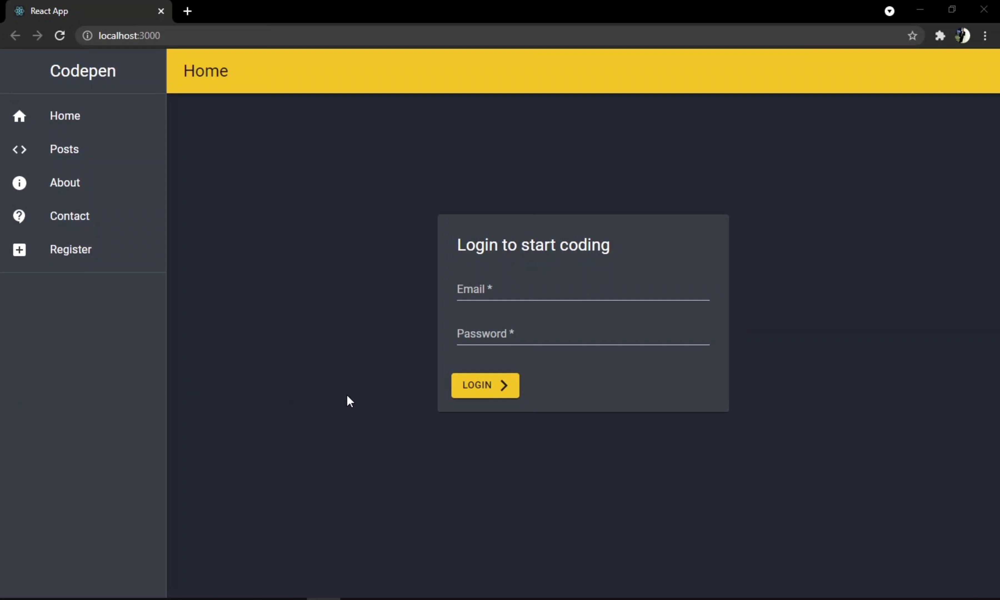
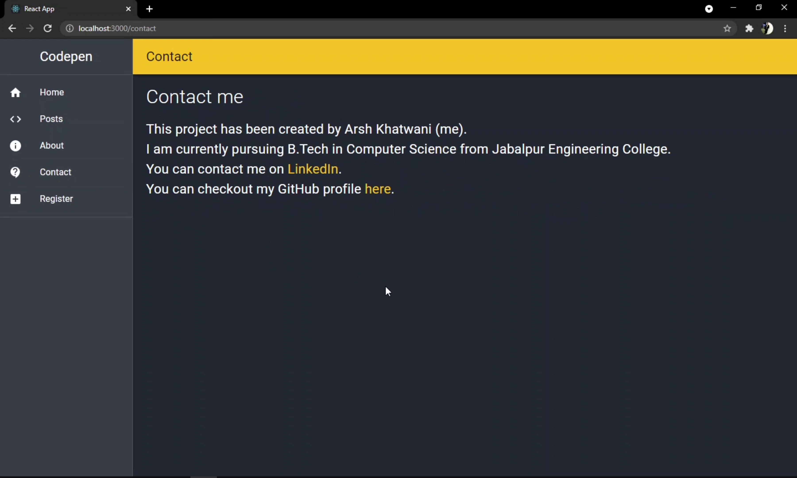

# A CodePen clone based on MERN stack

1. A coding environment for Web Designers and Front-End developers.
2. Users could register, create account, login to build, edit and delete their codes.
3. Users could access codes of other users on the platform for reference and could make temporary changes.
4. Front-End was created using React while Back-End was developed with NodeJS, Express with database as MongoDB.
   - React Material UI library was used in designing the Front-End.
   - JWT (Json Web Token) was used for authentication and protecting routes.

## Project video [here](./project_video_and_screenshots/project_video.mp4)

## Screenshots

